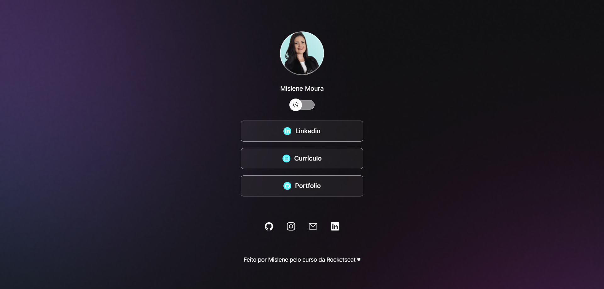
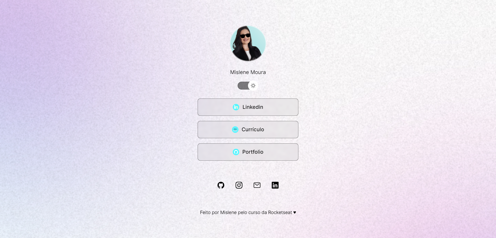
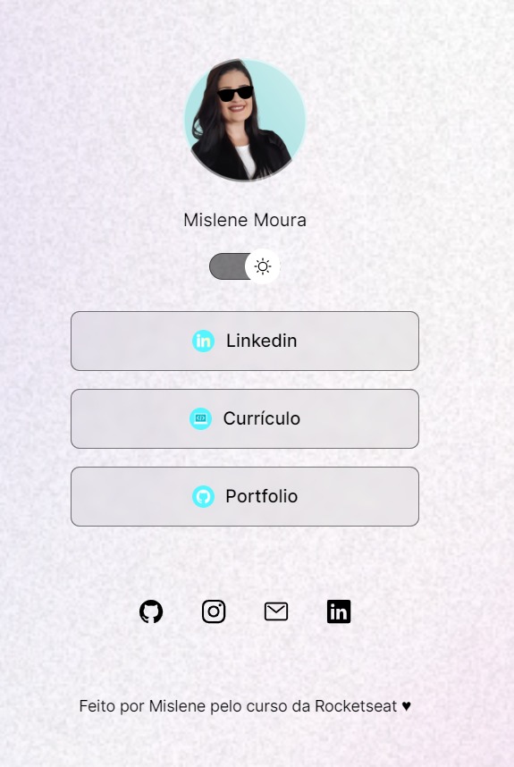

<h1 align="center"> DevLinks </h1>

Desenvolvido por:
 Mislene Moura - [Linkedin](https://www.linkedin.com/in/mislene-silva-moura-1211531b4//) |
   [Github](https://github.com/MisleneSM)

***

## Índice

* [1. Resumo do projeto](#1-resumo-do-projeto)
* [2. Objetivos de aprendizagem](#2-objetivos-de-aprendizagem)
* [3. Tecnologias Utilizadas](#3-tecnologias-utilizadas)

***

## 1. Resumo do Projeto🤩

Desenvolvido um mini projeto de agregador de links para utilizar como cartão de visitas online. Programa exclusivo e gratuito, promovido pela [Rocketseat](https://rocketseat.com.br) para ensino de tecnologias WEB, administrada pelo professor [Mayk Brito](https://github.com/maykbrito).

Para acessar o resultado do projeto basta clicar aqui no [Link](https://mislenesm.github.io/Projeto_DevLinks/)

## 2. Objetivos de aprendizagem✅

- HTML
- CSS
- Java Script
- Git e GitHub
- Figma

#### Objetivo do Projeto

#### Resultado Final do Projeto

##### Desktop

##### Mobile

## 3. Tecnologias Utilizadas✅ 

       
  
